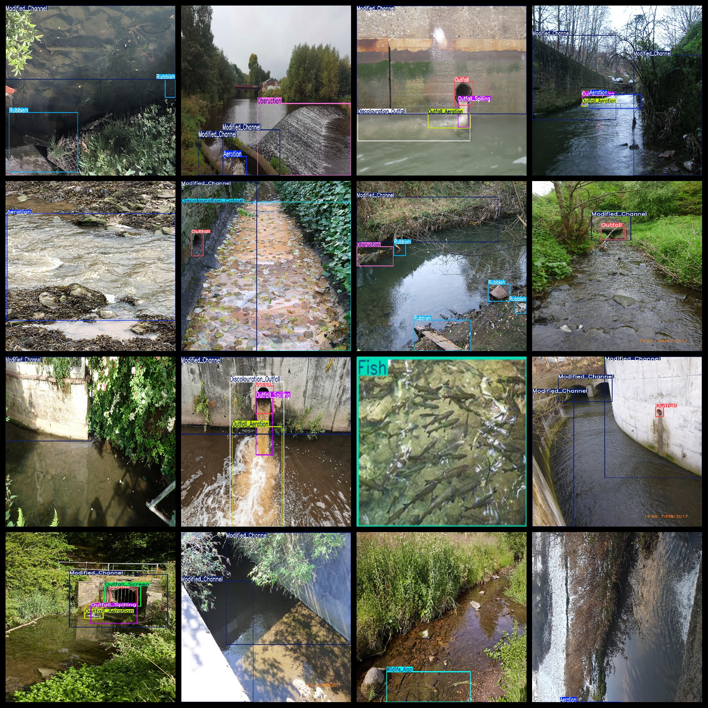
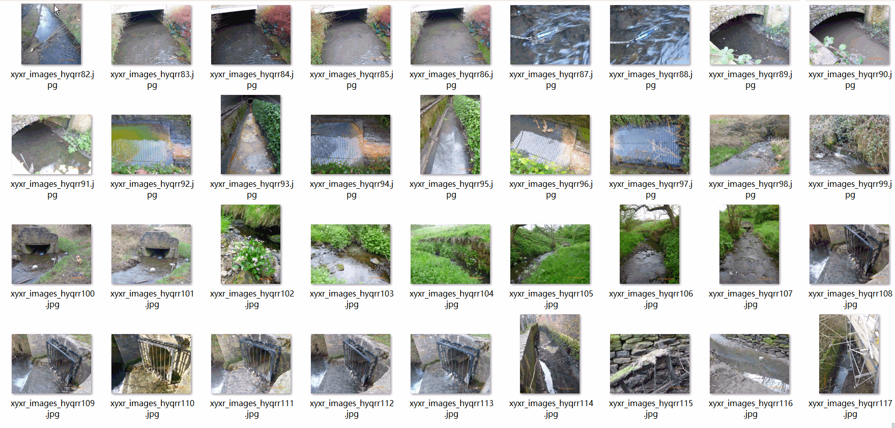

# River Word Inspection Dataset 1064 imagesVOC+YOLO format

River Patrol Dataset 1064 VOC + YOLO Format

Dataset format: Pascal VOC format + YOLO format (the txt file does not contain the split path, it only contains jpg images and corresponding VOC format xml files and yolo format txt files)

Number of images (total jpg files): 1064

Number of XML files: 1064

Number of txt files: 1064

Category count: 15

The Github repository is: datasets_sl

["Aeration", "Discolouration_Colour", "Discolouration_Outfall", "Fish", "Modified_Channel", "Obsruction", "Outfall", "Outfall_Aeration", "Outfall_Screen", "Outfall_Spilling", "Rubbish", "Sensor", "Wildlife_Algal", "Wildlife_Birds", "Wildlife_Others"]

Number of boxes labeled in each category:

Aeration Frames = 283 (aeration / oxygenation)

Discolouration_Colour Frames = 131 (Discolouration / Discoloration)

Discolouration_Outfall Frames = 43 (Outfall Discolouration)

Fish Frames = 103 (Fish)

Modified_Channel Frames = 644 (Hydraulic Reconstruction / Man-made Channels)

Obstruction Frames = 155 (obstacles / blockages)

Outfall Frames = 288

Outfall_Aeration frame count = 131 (aeration of outfall)

Outfall_Screen Frame Count = 183 (Outfall Screen / Baffle Screen)

Outfall_Spilling frame count = 208

Rubbish Frames = 412 (rubbish / waste)

Sensor Frames = 28 (sensor / monitoring device)

Wildlife_Algal Frames = 172 (algae / bloom)

Wildlife_Birds Frames = 267

Wildlife_Others Frames = 111

Total Frames: 3159

Number of images per category:

Aeration occupies a number of images = 217

Discolouration_Colour _has_108_images

Discolouration_Outfall _has_39_images

【34】

Modified_Channel occupies 522 images.

Observation Ownership of Pictures = 142

Outfall occupancy picture count = 260

Outfall_Aeration occupies 112 images.

Outfall_Screen occupies 169 images.

Outfall_Spilling has 204 images.

Rubbish has 208 pictures.

Sensor ownership count = 28

Wildlife_Algal occupies 105 images.

Wildlife_Birds have 60 pictures.

Wildlife_Others occupies a total of 34 images.

Image resolution: Multi-resolution images, such as 3840x2160, 3096x4128, etc.

Use the labeling tool: labelImg

Dataset Augmentation: No

Rules for annotation: Draw a rectangle around the category.

Important note: The dataset does not have been divided into training, validation, and testing sets.

Special Disclaimer: This dataset does not guarantee the accuracy of the trained models or weight files.

Annotation and image details are as follows:

## Images

---

Here is a pay link on Stripe (https://buy.stripe.com/3cs8yP7sY87d0vu9AB). Please contact me lonlonago@foxmail.com after funding $89, and I will send you a complete data files, thank you!

